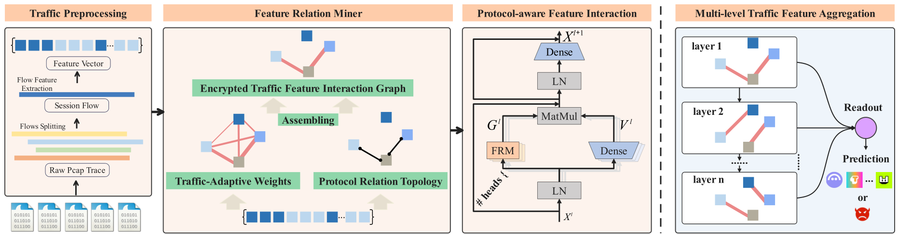

# FRM-ETA: Feature Relationship Mining-based Encrypted Traffic Analyzer

*Overview of FRM-ETA Model*.

## 📋 Requirements

```bash
torch>=1.9.0
numpy>=1.20.0
pandas>=1.3.0
scikit-learn>=1.0.0
category_encoders
tomli
tomli_w
```

## 📁 Project Structure

```
FRM-ETA/
├── bin/                    # Model implementations
│   ├── frm_eta.py         # Base FRM-ETA model
│   └── frm_eta_ood.py     # FRM-ETA with OOD detection
├── lib/                    # Core libraries
│   ├── data.py            # Data processing utilities
│   ├── deep.py            # Deep learning utilities
│   ├── env.py             # Environment configuration
│   ├── metrics.py         # Evaluation metrics
│   └── util.py            # General utilities
├── data/                   # Dataset storage
├── models/                 # Trained model storage
├── util/                   # Additional utilities
├── Training.py            # Main training script
└── Unknown_traffic_detection.py  # OOD detection script
```

## 🚀 Quick Start

### 1. Training a Model

```bash
python Training.py
```

The training script will:
- Load and preprocess the dataset
- Create OOD dataset splits
- Train the FRM-ETA model with mixed precision
- Save the trained model and configuration

### 2. OOD Detection

```bash
python Unknown_traffic_detection.py --dataset dapp --known-classes 40 \
    --model-path models/dapp/24classes/frm_eta_dapp_ood_40classes.pth \
    --config-path models/dapp/24classes/config_dapp_ood_40classes.json
```

### 3. Configuration

Edit the configuration in `Training.py`:

```python
config = {
    'dataset_name': 'dapp',  # Options: dapp:[1-44], mal:[1-23]
    'known_classes': 40,     # Number of known classes for OOD
    'batch_size': 256,
    'learning_rate': 0.0001,
    'epochs': 30,
    # ... other parameters
}
```

## 📊 Datasets

### Supported Datasets

1. **DAPP Dataset**: Network application classification
   - Classes: 1-44 (configurable)
   - Features: 84 numerical features
   - File: `data/dapp_84_features_label.csv`

2. **MAL Dataset**: Malicious traffic detection
   - Classes: 1-23 (configurable)
   - Features: Various numerical features
   - File: `data/label_encodered_malicious_TLS-1.csv`

3. **Data preparation**: Dataset download

    - You can download these datasets for pan.baidu.com. And place this CSV file in the `data` folder.

        ```html
        DAPP Dataset
        Link: https://pan.baidu.com/s/1dZbxe5YXZErGJa8hI5I6PQ?pwd=vfi8 
        The extraction code: vfi8
        
        MAL Dataset
        Link: https://pan.baidu.com/s/1dZbxe5YXZErGJa8hI5I6PQ?pwd=vfi8 
        The extraction code: vfi8
        ```

### Dataset Format

Datasets should be CSV files with:
- Numerical features in columns
- Target labels in the last column
- No missing values (will be handled automatically)

## 🔧 Model Configuration

### Key Hyperparameters

- `n_layers`: Number of transformer layers (default: 5)
- `d_token`: Token embedding dimension (default: 192)
- `n_heads`: Number of attention heads (default: 12)
- `d_ffn_factor`: FFN dimension factor (default: 2.0)
- `attention_dropout`: Attention dropout rate (default: 0.4)
- `ffn_dropout`: FFN dropout rate (default: 0.1)

## 📈 Performance

The model achieves excellent performance on OOD detection tasks:

- **AUROC**: >97% on benchmark datasets
- **FPR95**: <3% false positive rate at 95% recall
- **AUPR**: >99% area under precision-recall curve

## 🛠️ Advanced Usage

### Custom Dataset Integration

1. Prepare your CSV dataset with numerical features
2. Update dataset paths in the configuration
3. Adjust the number of classes and features
4. Run training with your custom configuration

### Model Customization

The architecture is highly configurable. You can:
- Modify attention mechanisms in `bin/frm_eta.py`
- Add custom activation functions in `lib/deep.py`
- Implement new data preprocessing in `lib/data.py`
